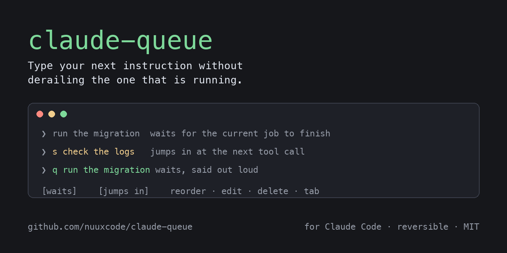
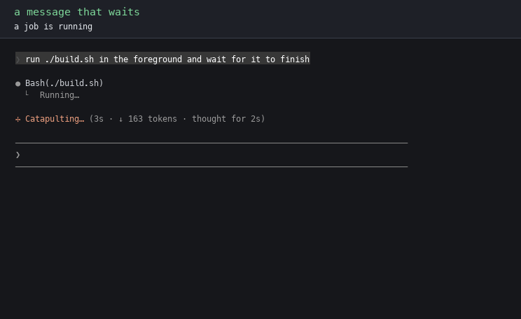
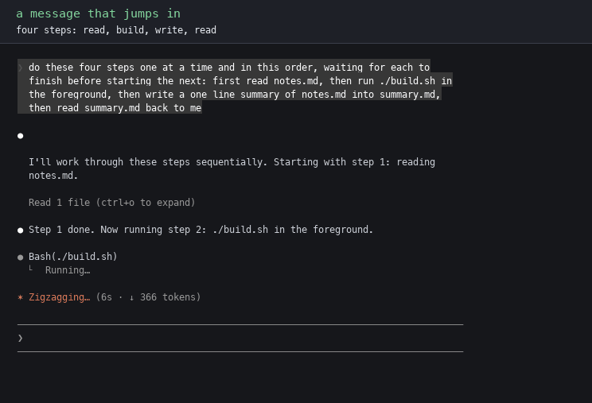

# claude-queue



**Type your next instruction into Claude Code without derailing the one that
is running.**

[](https://github.com/nuuxcode/claude-queue/actions)
[](https://github.com/nuuxcode/claude-queue/releases)
[](#install)
[](LICENSE)

> This page is the short version. Every measurement, edge case and receipt
> lives in **[the full story](docs/deep-dive.md)**.

Claude Queue is an independent, reversible local patch. It is not affiliated
with Anthropic.

## The problem

Claude Code is working. You think of the next thing and type it. Sometimes it
waits politely. Sometimes it lands in the middle of the running job and
changes its course, and nothing on screen tells you which one happened.
Timing decides, not you.

People have been asking for a fix
[since March 2025](https://github.com/anthropics/claude-code/issues/535).
VS Code, Copilot, Cursor, Kiro, Zed and Codex all give you this choice
already. Claude Code does not. So I patched mine.

## The fix

An optional label at the start of the message tells Claude Queue what you mean:

```
run the migration     no label: waits for the current job to finish
s check the logs      start with "s ": jumps in at the next safe moment
q run the migration   start with "q ": waits, said out loud
p rewrite the docs    start with "p ": parked, never runs until you say so
```

These are message prefixes, not live keyboard shortcuts. You write and submit
the whole message. A normal message waits by default. Start the submitted
message with `s ` only when you want it to steer the running turn, `q ` when
you want to say "wait" explicitly, or `p ` when you want to park the thought
without running it at all. Pressing `s`, `q` or `p` elsewhere does nothing to
the running turn, and the prefix is removed before Claude sees the message.
The screen labels the result as `[waits]`, `[jumps in]` or `[paused]`.

The waiting ones sit in a list you can see. Reorder them, edit one without
touching the rest, delete one you changed your mind about, or press left and
right to change what a message is going to do. Each runs as its own job, in
your order. Claude Code crashes or you close the terminal, the queue is still
there when you come back.

**A parked message is the one that never surprises you.** It sits in the list
like any other, and nothing that picks work will take it: not the current
turn, not the end of the turn, not a restart. Point at it and press left or
right when you are ready for it to mean something.

Nothing here fights the tool: Claude Code already has a queue inside it. This
patch gives you the controls.

## Watch it happen

Full demo, with sound:

https://github.com/user-attachments/assets/54f11df8-6bef-4ffd-8cf1-96b076cf3b35





These are real terminal recordings. The repository also includes the stock
reproduction, the full recording harness, and the rest of the queue controls.

## Using it

| you type | what happens |
|---|---|
| `fix the tests` | waits for the current job to finish |
| `s fix the tests` | jumps in while the job keeps running |
| `q fix the tests` | waits, labelled on screen |
| `p fix the tests` | parked: sits in the list and never runs until you change it |
| a long pasted `p ...` | works too. Pasted code like `q = deque()` still arrives as plain text |
| **tab** instead of enter | the opposite of your default, no letter needed |
| up / down | move through the waiting list |
| enter on a waiting message | pull it back to edit alone, send returns it to its slot |
| shift + up / down | move it earlier or later |
| left / right | change what it will do: waits, jumps in, paused, and round again |
| ctrl + enter | let go of the list and run what is runnable, now |
| `/model`, `/status`, `/usage` | open at once, even mid-turn. They change nothing Claude is doing, so they do not wait |
| delete | remove it, only while the editor is empty |

Reading the list never stops it. **Changing a mode does**, until you let go,
which is what lets you cycle past `waits` to reach `jumps in` without it
firing on the way. Let go with **ctrl and enter** to run it now, or by
stepping off the list with down, or by typing anything.

Messages brought back from a previous session are held harder: they read
`[waits, restored]` and will not run just because you opened a terminal.
**Ctrl and enter releases those too**, because pressing a key while pointing
at one message says you are here and you mean it. Stepping off the list does
not, since that can be the tail end of browsing.

On an idle session `waits` and `jumps in` mean the same thing, because there
is no running turn to wait for or jump into. Both mean run it now.

Coming from Codex? `export CLAUDE_QUEUE_DEFAULT=steer` gives you the same
arrangement: enter jumps in, tab queues.

## Install

Works on the npm install of Claude Code on macOS and Linux. Needs Python 3.9+
and Node.js. WSL2 is not yet verified. Verified on Claude Code 2.1.220, the
current npm release, last checked 2026-07-29.

The recommended first step is to clone the repository and run the no-change
check:

```bash
git clone https://github.com/nuuxcode/claude-queue
cd claude-queue
./install.sh --dry-run
```

Read the output and the script. If you accept the local patch and signature
change, install it:

```bash
./install.sh
```

The equivalent one-line dry run is:

```bash
curl -fsSL https://raw.githubusercontent.com/nuuxcode/claude-queue/main/install.sh | bash -s -- --dry-run
```

Disk use varies with the Claude Code binary and retained backups. On the
machine checked on 2026-07-29, `~/.claude-patch` used about 338 MB: one 245 MB
stock backup, about 88 MB of locked patch tooling, and the project files.

Afterwards, `claude-queue status` shows it is on. Undo any time:

```bash
claude-queue restore       # puts the original back, byte for byte
```

On a Claude Code release it does not recognise, it refuses and changes
nothing. It never guesses.

## Claude Code updates, in 30 seconds

Claude Queue is not a separate Claude. It patches your existing npm-installed
Claude Code on this machine.

With the normal install, its small `claude` launcher stays first on your PATH.
When Claude Code updates itself and replaces its executable, the next `claude`
launch notices, saves that new stock executable, and re-applies the exact
Claude Queue code you already approved. You do **not** need to run
`claude-queue update` after every Claude Code update. This automatic recovery
is not available when installing with `--no-path`.

If the new Claude Code release no longer matches the patch safely, Claude Queue
fails open: it leaves the new stock Claude Code unchanged and starts it. Check
the result with `claude-queue status`. A future compatible Claude Queue release
can then be installed normally.

`claude-queue update` is for updating **Claude Queue itself**, not Claude Code.
From a git clone it fetches, shows the incoming commits and files, asks for
your approval, then installs the update. It never runs newly changed patch code
without that approval. If you installed from the release one-liner instead,
rerun the current installer. It fetches the current release and asks before
installing it.

```bash
claude-queue status   # confirm the active Claude Code version and patch state
claude-queue update   # git-clone installs only: review, then approve an update
claude-queue restore  # remove the patch and restore the recorded stock binary
```

## Before you install

This modifies your installed copy of Claude Code and re-signs it locally, so
it is no longer signed by the original publisher, and Anthropic's terms
restrict modifying the software. Reversible, on your own machine, but the
decision is yours. If your laptop is company-managed, do not install this.

Saved queues are your own prompt text in a file inside your project. Add
`.claude/queue-*.json` to your `.gitignore`, or set
`CLAUDE_QUEUE_PERSIST=off`.

A queue belongs to one session. Resume that session, with `--continue` or
`--resume <id>`, and it comes back. **A different session never sees it**, so
nothing you queued in one terminal can turn up in another. Picking a session
from the `/resume` menu forks it into a new session, so that path does not
bring the queue back; the file is left on disk untouched rather than deleted.

## Why believe any of this

- Before touching anything I recorded unpatched Claude Code running one long
  job with two follow-ups typed while it worked: it started the second
  message first, merged both into one answer, and the screen never said a
  word. The [recording harness](harness/) ships here, point it at your own
  machine.
- 121 behaviour scenarios in the ledger, 112 driven, every remaining gap
  named in place. [The suites ship too](harness/behaviour/).
- The research measures both dangers. A model interrupted mid-thought lost
  [up to 60% accuracy](https://arxiv.org/abs/2510.11713) in one study. A
  model fed its task in scattered pieces did
  [39% worse](https://arxiv.org/abs/2505.06120) in another. That is why both
  buttons exist: waiting, and jumping in cleanly.
- Everything above, with every number sourced:
  [the full story](docs/deep-dive.md).

## Read more

| | the question it answers |
|---|---|
| [The full story](docs/deep-dive.md) | Everything on this page, with every measurement, setting and edge case |
| [The evidence](docs/the-evidence.md) | Is this a real problem, or one person's annoyance? |
| [What this guarantees](docs/guarantees.md) | What does it promise, and what does it deliberately not promise? |
| [Behaviour in detail](docs/behaviour.md) | What exactly changes, and how was each part tested? |
| [Why turn boundaries matter](docs/why-turn-boundaries-matter.md) | Why is wrong ordering worse than a display annoyance? |

## Licence

[MIT](LICENSE). Not affiliated with Anthropic.
