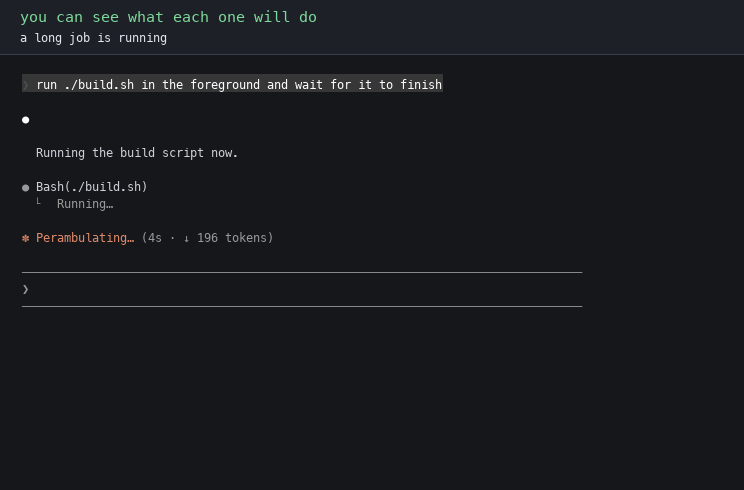
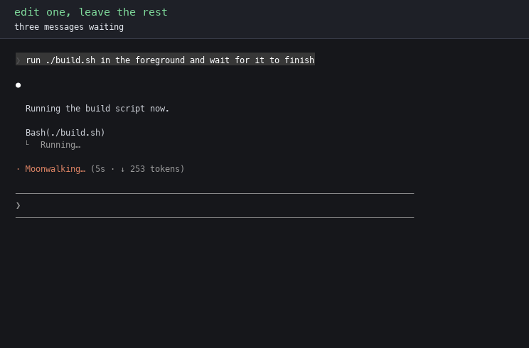
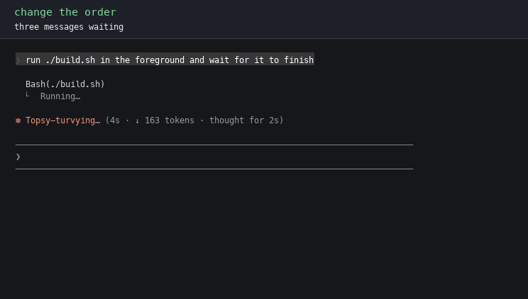
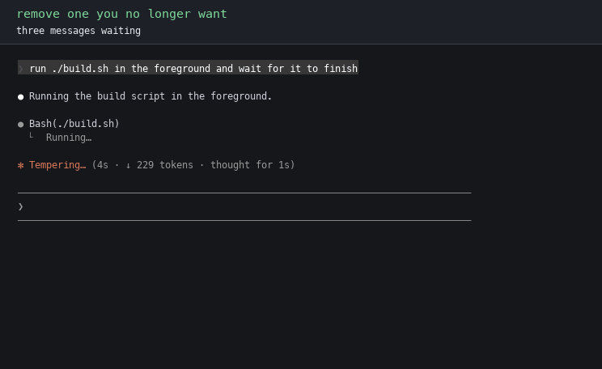
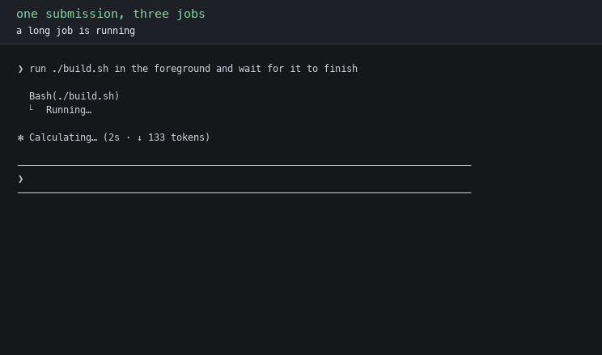
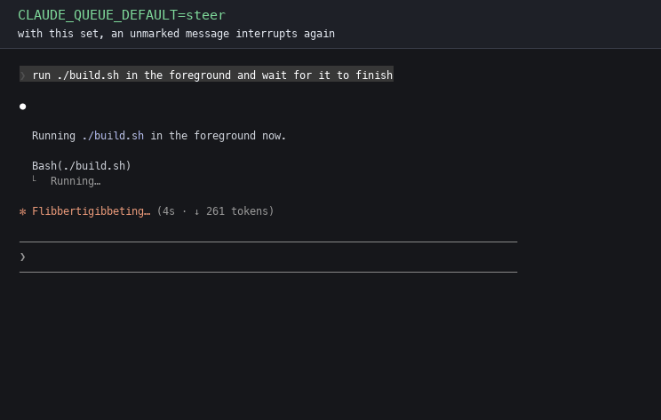
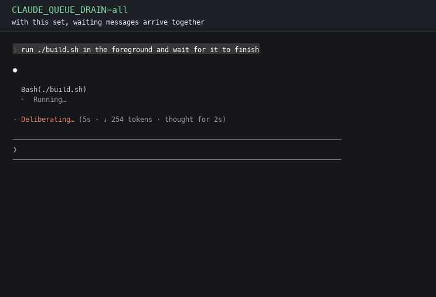

# claude-queue, the full story

**This is the long version, every measurement, edge case and receipt in one
place. The short version is the [README](../README.md).**


**Type your next instruction without derailing the one that is running.**

[](https://github.com/nuuxcode/claude-queue/actions)
[](https://github.com/nuuxcode/claude-queue/releases)
[](#install)
[](../LICENSE)

Three words this page leans on. A **turn** is everything Claude does from
your message until it stops and waits for you. A **tool call** is one single
action inside a turn, like reading a file or running one command; the small
gap after one tool finishes and before the next starts is a **tool
boundary**, the earliest moment a message can reach Claude without breaking
anything. **Stock** means Claude Code as installed, without this patch.

Claude Code is working. You think of something. You type it, and one letter at
the front decides when it runs:

```
run the migration     no letter: waits for
                      the current job to finish
s check the logs      "s" steers: jumps in at
                      the next tool call
q run the migration   "q" queues: waits,
                      said out loud
p rewrite the docs    "p" parks it: never runs
                      until you change it
```

Waiting messages stack up in a list you can see. You can reorder them, edit any
one alone, delete one, or change what one of them is going to do. Each runs as
its own turn, in the order you typed.

**The guarantee, in one line:** how long a tool takes cannot change which of
your messages wait and which jump in. That is decided when you press enter, not
by whichever tool finishes next.

Coming from Codex? One line in your `~/.zshrc` or `~/.bashrc`,
`export CLAUDE_QUEUE_DEFAULT=steer`, gives you the same arrangement:
enter steers, tab queues. Every new session reads it at start.

---

## The problem

When you type into a running agent you mean one of two different things:

| you mean | required behaviour |
|---|---|
| **"do this next"** | stay out of the running turn, run afterwards |
| **"use this now"** | reach the running turn and change what it does |

Claude Code has **one input channel for both**: your message is delivered at
the next tool boundary, or at the end of the turn if no boundary comes first.
Which one you get is decided by tool timing, not by what you meant.

Claude Code's own changelog announces the same action twice, first as a
queue, then as steering:

```
0.2.75    Hit Enter to queue up additional messages while Claude is working
0.2.108   You can now send messages to Claude while it works to steer Claude
          in real-time
```

Since then the changelog carries 34 entries about queued or steering messages
across 27 releases: messages lost, duplicated, merged, stuck, executed as bash,
ignored. [Every citation, checked against the source](the-evidence.md).

### Watch it happen

One real job, big enough to run for minutes. Two follow-ups typed while it
builds, phrased the way anyone types them. The video opens with stock and
patched running side by side, then walks through the rest of the queue. Every
frame is a recording of a real terminal. Sound is on the key presses.

https://github.com/user-attachments/assets/54f11df8-6bef-4ffd-8cf1-96b076cf3b35

**Stock:** the message typed second was started first, and nothing on screen
said so. **Patched:** same job, same two messages, sent after the same
verified tool milestones. Each one waits, then runs in the order it was typed.

What the recordings measured, typed-at to started-at:

| | stock | patched |
|---|---|---|
| `CHANGELOG.md`, typed **first** | 0:15 to 1:43 | **0:14 to 2:09** |
| `metrics.py`, typed **second** | **0:46 to 1:21** | 0:42 to 2:21 |

Stock ran them backwards. Both runs used Haiku on Claude Code 2.1.220 in safe
mode with hooks, plugins, MCP servers and memory disabled; the patch is the
only difference between the driven binaries. Do not take my word for it, the
harness ships in [`harness/`](../harness/):

```bash
cd harness
./record.py --binary "$(which claude)" --label mine
./measure.py runs/mine.json
```

---

## Install

**Verified on Claude Code 2.1.220 through 2.1.223** (last checked 2026-08-06). On a release
where the code has moved, it **refuses and writes nothing** rather than
guessing; you keep working on stock until the patterns are updated.

Works on the **npm install** of Claude Code on macOS and Linux. Check yours
with `npm ls -g @anthropic-ai/claude-code`: empty output means a native,
Homebrew or bun install, which is not supported. WSL2 should behave as Linux
but has not been tested here. Needs Python 3.9+ and Node.js, and about 600 MB
of disk steady-state, two stock backups included.

Two ways in. The [README](../README.md#install) has a one-line installer for
the copy-paste crowd; this is the read-it-first path, and the two run exactly
the same code:

```bash
git clone https://github.com/nuuxcode/claude-queue
cd claude-queue
./install.sh --dry-run     # shows exactly what it would do, changes nothing
./install.sh
claude-queue status        # healthy:  claude-queue  ON  v2.x.x
```

If it refused, the message names the check that failed; please
[open an issue](https://github.com/nuuxcode/claude-queue/issues) with your
Claude Code version. Undo any time:

```bash
claude-queue restore       # puts the original binary back, byte for byte
```

<details>
<summary><b>Installer flags, and what the one PATH line is for</b></summary>

| flag | what it does |
|---|---|
| none | patch Claude Code, add one launcher line to `~/.zshrc` or `~/.bashrc`, ask before writing |
| `--dry-run` | print every step it would take and change nothing |
| `--no-path` | patch only, leave your shell config alone |
| `--yes` or `-y` | do not ask for confirmation |

The launcher line puts a small wrapper ahead of `claude` on your PATH. Claude
Code replaces its own program when it updates, which removes the patch; the
launcher notices and re-applies the same already-approved code before starting,
never anything new. With `--no-path` you re-apply after updates yourself with
`claude-queue install`.

</details>

---

## Using it

**Sending, while Claude works:**

| you type | when it runs |
|---|---|
| `fix the tests` (no marker) | after the current turn finishes |
| `q fix the tests` or `q: ...` | after the current turn finishes, said explicitly |
| `s fix the tests` or `s: ...` | at the next tool boundary, while the job is still running |
| `p fix the tests` or `p: ...` | never, until you give it another mode |
| **tab** instead of enter | the opposite timing to your default, no marker needed |

Markers need a space or colon after the letter, so `start the server`,
`print the totals` and `queueing jobs` are ordinary text, and so are the words
`queue` and `steer`. To send a message that really starts with `q`, type one
space first.

Pasted text is held to a higher bar, because pasted code can begin with a
letter that looks like a marker. Two things relax it:

- The paste test asks whether the message **starts** with something pasted.
  Type `p ` yourself and paste the body after it, and the marker was typed, so
  it counts.
- A pasted marker in the space form counts when a **letter or digit** follows
  it. `p Okay, so we did pass one` is a sentence. `q = deque()` is an
  assignment, and the character after the space is what tells them apart.

So a long prompt pasted as `p <lots of text>` parks, while `q = deque()` and
`p = Path(x)` still arrive untouched. The colon form always counts.

A parked message is queued and never chosen. Claude Code ranks queued work
with a small table, and every place that picks something to run compares
against it: the mid-turn fold, the peek and the dequeue. Parked messages carry
a rank that table does not contain, and a missing rank loses every comparison,
so all three skip it without a new gate anywhere in the running path. It
cannot leak into a turn by accident, it survives as many turns as you like,
and it comes back parked after a restart.

**Managing the waiting list:**

| key | what it does |
|---|---|
| up / down | move the highlight through the waiting messages |
| enter | pull the highlighted one back into the editor, alone; sending returns it to its slot |
| shift+up / shift+down | move it earlier or later, highlight travels with it |
| left / right | change its mode: waits, jumps in, paused, and round again |
| ctrl + enter | let go of the list and run what is runnable, now |
| delete / backspace | remove it, **only while the editor is empty** |

**Reading the list never stops it draining. Changing a mode does**, until you
let go of it. That asymmetry is deliberate. Without the hold, moving a parked
message onto "waits" in an idle session ran it on the way past, so the third
mode could never be reached; with the hold applied to mere reading, a queue
you were only looking at stopped when the turn ended, which surprised nobody
in a good way.

Let go with ctrl and enter to run it now, by stepping off the list with down,
or by typing anything.

A resumed session holds the messages it brought back until you do something
deliberate, so that a queue saved yesterday cannot start running because you
opened a terminal. Sending anything has always released that hold. Ctrl and
enter releases it as well, on the same reasoning: a key pressed while pointing
at one specific message says you are here and you mean this one. Stepping off
the list is deliberately not enough, because that can be the tail end of
browsing.

On an idle session "waits" and "jumps in" describe the same moment, because
there is no running turn to wait for or jump into. Both mean run it now. The
distinction only earns its keep while Claude is working.

Every waiting message is labelled on screen, so you never guess whether a
marker registered. Labels never reach Claude:



A waiting message taller than one line is drawn as its first line and a count
of the lines it is holding back, so three long ones cannot push the transcript
and the busy indicator off the screen. The highlighted one is always drawn in
full, so up and down let you read any of them completely. Only the display is
folded: what reaches Claude, and what comes back when you pull a message into
the editor, is every line you typed.

**A queue belongs to one session and only that session ever opens it.** The
file is named for the session id. `--continue` and `--resume <id>` keep the
id, so those bring the queue back. Picking a session out of the `/resume` menu
forks it into a NEW id, so that path does not, and the file is left on disk
rather than deleted.

Restoring the newest file in the project instead, when no file matched the id,
was the previous behaviour and it leaked: every brand new session in the same
directory also matches "no file for my id", so it adopted whatever the last
session left, re-keyed it, and passed it on. Three terminals in, one queue held
every message ever parked there. `CLAUDE_QUEUE_ADOPT=on` restores that
behaviour for anyone who wants the picker path covered and accepts the leak.

**Waiting messages survive a restart.** Every change to the queue is written
to a small file in this project's `.claude` directory, named for the session.
Come back to that project, however you come back, and the messages return as
rows reading `[waits, restored]`. `claude --continue` and `claude --resume
<id>` keep the session id and find that session's own file. Picking the
session out of the `/resume` menu does not keep the id, it forks a new one,
so a session that finds no file of its own takes over the newest one this
project has waiting and leaves nothing behind for the next session to pick up
twice. You can read them,
reorder them, edit them or delete them, exactly as before. Nothing runs on
its own when they come back: the queue sits there until you send something
yourself, your message runs as the turn, and the restored ones drain after
it, one at a time, in the order they were saved. A message you wrote
yesterday should not start executing against today's code just because you
opened a terminal, especially in a session that skips permission prompts. A
message is removed from the file the moment it is taken out to run, so a
crash halfway down a queue offers back only what had not run, and when the
queue empties normally the file is deleted.

> [!IMPORTANT]
> **Reordering does not make anything run sooner.** Every waiting message
> waits for the turn to end, including the one on top. Need something NOW?
> Do not queue it and drag it up. Send `s ...`: it jumps the whole queue and
> lands at the next tool call, without killing the running work the way
> Escape does.

**Steer, Escape, queue, side by side:**

| | what happens to the running work |
|---|---|
| Escape (editor empty) | the in-flight tool is killed and its work discarded; edits already written to disk stay. The turn ends, your waiting messages are kept, and the first one starts |
| `s ...` | current tool finishes, then your message lands, mid-turn |
| queue | whole turn finishes, then your message runs as its own turn |

A steer lands at the next tool boundary, the gap between one action ending
and the next starting. If Claude is inside one fifty second test command,
your `s` arrives the moment that command ends, and the rest of the job
continues with your correction on board. Nothing reaches
into the middle of a running command: for that you need Escape, and the same
is true in every agent CLI, Codex included. Both halves were driven: a steer
saved a file whose write had not started yet, and could not save one already
written. The steer clip below shows it,
the correction lands between two tool calls while the job keeps going.

<details>
<summary><b>A real session, start to finish</b></summary>

Claude is forty seconds into a refactor. You think of two next jobs, then spot
a mistake:

```
update the README to match          no marker, waits
then run the full test suite        waits
s you are editing the wrong module  jumps in
```

The screen labels each one:

```
❯ [waits] update the README to match
❯ [waits] then run the full test suite
❯ [jumps in] you are editing the wrong module
```

You reorder: press up until the README message is highlighted, then shift+down,
because the README should describe whatever the tests end up saying. You fix a
typo: enter pulls that one message back alone, the others stay queued; sending
it returns it to the same slot, keeping its marker.

What actually happens, in order:

```
1.  the steer lands at the next tool call, mid-refactor
2.  the refactor turn ends
3.  then run the full test suite      its own turn
4.  update the README to match        its own turn, and it can use what the tests said
```

That last line is the point: each waiting message runs as its **own** turn, so
the first one's result is on screen before the second starts. Stock hands
everything over in one turn, where the first result cannot inform the second.


</details>

<details>
<summary><b>Edit, reorder, delete: the clips</b></summary>

Up and down move a highlight without touching the editor. Enter pulls back
**only** the highlighted message; the rest stay queued. It returns to the slot
it came from, with its marker intact. Escape pressed while editing abandons
the edit the way stock does: it stops the turn and empties the whole queue
into the editor, joined, so you can rescue the text or clear it:



Shift with an arrow moves the highlighted message. It only swaps with
messages of the same kind. Jumping messages always run before waiting ones,
whatever the list shows, so letting them cross would move the display without
moving the work:



Delete or backspace removes the highlighted one, only while the editor is
empty. The moment you type anything, backspace edits text exactly as it always
has:



</details>

<details>
<summary><b>Several jobs in one paste</b></summary>

In a pasted batch, a colon marker starts a new job and an unmarked line
continues the job above it. The first nonblank line must use `q:` or `s:`,
otherwise the whole paste stays one literal message. A multi-line block you
TYPE (not paste) splits on `q ` and `s ` markers too, and typed text before
the first marker becomes its own message at your default timing:

```
q: write the migration notes          ->  job 1, waits
q: then run the test suite            ->  job 2, waits
and tell me what broke                ->      ... still job 2
s: you are editing the wrong module   ->  job 3, jumps in
```



Works busy or idle: if nothing is running, the first job becomes the turn and
the rest queue behind it.

</details>

<details>
<summary><b>Settings: five environment variables</b></summary>

Each has exactly two states; the default is what you get when it is unset.

| variable | default, when unset | set to | and you get |
|---|---|---|---|
| `CLAUDE_QUEUE_DEFAULT` | no marker waits | `steer` | no marker interrupts, like stock. `q` still waits. This is the Codex arrangement, and tab then queues |
| `CLAUDE_QUEUE_DRAIN` | waiting messages run one at a time | `all` | all handed over in one turn, like stock |
| `CLAUDE_QUEUE_LABELS` | queued messages are tagged on screen | `off` | no tags |
| `CLAUDE_QUEUE_COLLAPSE` | a long waiting message is folded to one line | `off` | every waiting message drawn in full, however tall |
| `CLAUDE_QUEUE_PERSIST` | waiting messages are saved, and come back when you resume the session | `off` | nothing is written to disk and nothing is restored |
| `CLAUDE_QUEUE_ADOPT` | a queue is only ever restored into the session that saved it | `on` | a session with no queue of its own adopts the newest one in the project, which also lets it leak between unrelated sessions |
| `CLAUDE_QUEUE_MODEL_NOW` | `/model` opens at once while Claude works, like `/status` | `off` | `/model` queues until the turn ends, which is Anthropic's own default |

The value must match exactly, lower case; anything else leaves the default in
place. To return to a default, `unset` the variable. Setting all five gives
you stock's TIMING back; the queue editor, the labels and the folding are
part of the patch's interface and remain available.





</details>

<details>
<summary><b>Edge cases worth knowing</b></summary>

What happens to waiting messages when:

| event | your waiting messages |
|---|---|
| `/model` typed while a tool is running | **it opens the picker at once, and the turn keeps running.** Stock queues it instead, driven side by side on 2026-07-30. Claude Code had already built the immediate version and left it behind a gate that ships off; this turns the gate on, so /model now behaves like /status and /usage, which were already immediate. `CLAUDE_QUEUE_MODEL_NOW=off` hands the decision back to Anthropic's gate. Choosing a model does not change the turn that is running: Claude Code says so itself, "the full history gets re-read on your next message" |
| `/compact` typed while messages wait | it QUEUES, shown as `[waits] /compact`, and runs in its turn. Messages queued behind it survived the compaction and ran after it (driven with manual `/compact`; the automatic 95% compaction was not driven) |
| Escape, editor empty | kept. The turn ends and the first one starts. Disk edits already made by the killed tool remain |
| Escape while editing a pulled-back message | the whole queue is emptied into the editor, joined, same as stock. Nothing runs until you send again |
| a marker typed while idle | there is nothing to wait for, so it simply runs, marker stripped |
| Claude Code exits or crashes | kept. Resume the session and they come back reading `[waits, restored]`, in order. Nothing runs until you send something yourself |
| you resume in a different project | nothing comes back. The file lives in the project you queued them in, so another directory never sees it |

And the small print of the keys:

- A steer that names the exact file or function and ends with "then continue
  the original plan" lands far better than "no, not like that": it arrives at
  the next tool boundary, and by then the screen may have moved past the thing
  you were reacting to.
- Shell commands (`!`) are never marker-parsed, so a command starting with
  `q` cannot be mangled.
- Slash commands are never marker-parsed, and they differ from each other
  while Claude works: `/status`, `/usage` and `/model` open straight
  away, `/compact` queues. Only `/model` differs from stock, and only
  because a finished feature was sitting behind a gate.
- Tab does nothing in stock Claude Code's prompt box, and the completion menu
  still takes it first when open, so nothing you already use is displaced.
- A marker still wins over tab: `q ...` plus tab waits, because an explicit
  instruction should not be reversed by a keystroke.
- When a turn ends, interrupting messages still run before waiting ones.

</details>

---

## Can you trust it?

> [!WARNING]
> Three things to know **before** installing, not after. (1) This modifies
> your installed copy of Claude Code, and Claude Code's terms restrict
> modifying the software; the change is reversible and on your own machine,
> but the decision is yours, eyes open. (2) The patched copy is re-signed
> locally, so it is **no longer signed by the original publisher**. If your
> machine is employer-managed (MDM or endpoint security), do not install
> this. (3) Not affiliated with Anthropic, and not legal advice.

What protects you, each checkable from your own disk:

- The original binary is saved first; `claude-queue restore` puts it back
  **byte for byte**.
- The patched program is built to one side and **run once** before it may
  replace the working one.
- On any Claude Code release it does not recognise, it refuses and writes
  nothing, naming the check that failed.
- The launcher fails open: if anything goes wrong, Claude Code still starts,
  just unpatched.
- **No telemetry, no network calls of its own.** `claude-queue update` talks
  to GitHub only when you run it, shows the change, and applies nothing until
  you agree. The one automatic act is the launcher re-applying the same
  already-approved patch after Claude Code updates itself, never anything new.
- One npm dependency, [tweakcc](https://github.com/Piebald-AI/tweakcc),
  **pinned at 4.3.2 with its sha512 integrity hash in the shipped lockfile**
  (`lib/tweakcc-package/`), installed with lifecycle scripts disabled.
- Maintained by [Mounssif BOUHLAOUI (@nuuxcode)](https://github.com/nuuxcode).
  Security reports: [SECURITY.md](../SECURITY.md).

**Saved queues live in your project, so ignore them in git.** A waiting
message is your prompt text, and with persistence on it is written to
`.claude/queue-<session-id>.json` inside the repository you are working in.
That is what makes a queue belong to one project instead of leaking between
them, and it also means one careless `git add -A` would commit what you were
about to ask for. Add `.claude/queue-*.json` to your `.gitignore`. The file
holds the text of the waiting messages, nothing else, and Claude Code already
stores the same text in its own session transcripts under your home
directory. `CLAUDE_QUEUE_PERSIST=off` stops it being written at all.

| command | what it does |
|---|---|
| `claude-queue status` | is it on, and whether an update is waiting |
| `claude-queue verify` | show the patched code, read from your own disk |
| `claude-queue restore` | turn it off, restore the original byte for byte |
| `claude-queue doctor` | check everything this needs |
| `claude-queue update` | fetch, show, ask, then apply |

No Claude Code source ships in this repository, only the small matching
patterns needed to locate compatible code in your own installed binary.

---

## How it works, in one paragraph

Claude Code already stores every queued message with a priority and already
empties that queue mid-turn and at end-of-turn; stock is picky about priority
only mid-turn, and the patch teaches the end-of-turn pass to match priority
too, one message per turn. This patch builds no queue of its own: it sets the
priority from your marker at the moment you press enter, and removes the
marker. `s` does not improve steering: stock already gives a mid-run message
the interrupting priority, and `s` sets the same one on the same path,
deliberately. What is new is the waiting route: a waiting message fails the
mid-turn filter on a fast tool and a slow tool alike, which is why timing
cannot reclassify your message. The queue editor is Claude Code's own
unreleased code, switched on surgically; reordering is the one genuinely new
operation. Full detail, edit by edit: [behaviour.md](behaviour.md).

---

## FAQ

**Is it safe?**
The section above is the answer, and every claim in it is checkable from your
own disk: `--dry-run` before, `verify` after, `restore` to leave.

**How do I uninstall, completely?**
`claude-queue restore` puts the original binary back byte for byte. Two things
remain by design and are yours to remove: the one launcher line the installer
added to `~/.zshrc` or `~/.bashrc`, and `~/.claude-patch/` (about 600 MB of
backups and tooling), removed with `rm -rf ~/.claude-patch`.

**What happens when Claude Code updates?**
Updates replace the binary, which removes the patch. The launcher re-applies
the same approved code on the next start. If the new release moved the code
this patches, it refuses cleanly and you run stock until the patterns catch up.

**My queue looks stuck while it says "Waiting for 1 background agent to
finish". Is it?**
No. That state does not hold the queue, and neither does bash work pushed to
the background with ctrl+B. Both were driven with a stopwatch against an
unpatched Claude Code: a message queued at 17.9 seconds ran when the turn ended
at 44.3, while the agent kept going until 108. Stock behaves identically, so
this is not something the patch introduced or could change. Claude Code has a
run phase named `waiting_for_agents` and deliberately does not count it as
busy.

**Why patch the binary instead of an extension or MCP server?**
The behaviour being fixed lives in the input path of the terminal app itself;
no plugin surface reaches it. The patch is small, refuses on mismatch, and is
reversible. The alternative is waiting on a request
[open since March 2025](https://github.com/anthropics/claude-code/issues/535),
whose successor is [#50246](https://github.com/anthropics/claude-code/issues/50246).

**Why hasn't Anthropic fixed it?**
Two groups ask for opposite things in the same tracker: queue it
([#535](https://github.com/anthropics/claude-code/issues/535), the original
March 2025 ask, auto-closed by the stale bot despite 30 reactions, and
[#50246](https://github.com/anthropics/claude-code/issues/50246), its
successor, open with over 160 upvotes) versus steer faster
([#30492](https://github.com/anthropics/claude-code/issues/30492),
[#64624](https://github.com/anthropics/claude-code/issues/64624)). Over 50
issues about this are open today. Both camps are right at different moments,
so no single default can win; the fix is choosing per message. Codex separates the two at the protocol level and still shipped
[a regression](https://github.com/openai/codex/issues/17285) here. Hard, not
neglected. Meanwhile the choice itself has become the industry norm: VS Code,
Copilot, Cursor, Kiro, Zed, Codex and Hermes all document explicit busy-input
controls today
([receipts](the-evidence.md#it-is-not-two-teams-it-is-the-industry)),
and the research now measures a real cost on both sides of the default
([the argument](why-turn-boundaries-matter.md#the-research-splits-the-same-way-the-tracker-does)).

---

## Read more

| | the question it answers |
|---|---|
| [The evidence](the-evidence.md) | Is this a real problem, or one person's annoyance? |
| [What this guarantees](guarantees.md) | What does it promise, and what does it deliberately not promise? |
| [Behaviour in detail](behaviour.md) | What exactly changes, and how was each part tested? |
| [Why turn boundaries matter](why-turn-boundaries-matter.md) | Why is wrong ordering worse than a display annoyance? |
| [The harness](../harness/) | How do I reproduce the numbers in this page myself? |
| [The behaviour suites](../harness/behaviour/) | Can I run the checks behind the promises? |

## Licence

MIT. See [LICENSE](../LICENSE).
